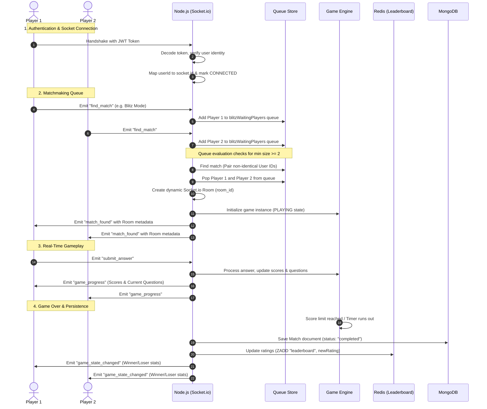

# Mathify: Real-Time Multiplayer Mental Arithmetic Engine

Mathify is a highly responsive, low-latency multiplayer mental arithmetic battle platform. Players compete in real-time speed math challenges across various modes, including **Blitz** and **Survival**. 

This repository houses the complete backend and frontend architecture designed to scale socket connections, handle high-frequency events, and ensure smooth data persistence.

---

## 🏗️ System Architecture

Mathify is built on a decoupled, event-driven architecture designed to minimize latency and ensure eventual persistence. Below is the core data flow from the client to the persistent storage layer:


<details>
<summary>📐 View Text-Based Mermaid Source Code</summary>

```mermaid
graph TD
    %% Define Styles
    classDef clientStyle fill:#e0f2fe,stroke:#0284c7,stroke-width:2px;
    classDef netStyle fill:#fef3c7,stroke:#d97706,stroke-width:2px;
    classDef serverStyle fill:#f0fdf4,stroke:#16a34a,stroke-width:2px;
    classDef cacheStyle fill:#fee2e2,stroke:#dc2626,stroke-width:2px;
    classDef dbStyle fill:#faf5ff,stroke:#9333ea,stroke-width:2px;

    %% Elements
    Client["📱 Client (React / Vite Frontend)"]:::clientStyle
    
    subgraph Network ["🌐 Network & Real-Time Layer"]
        HTTP["HTTP REST APIs (Express Router)"]:::netStyle
        WS["WebSockets (Socket.io)"]:::netStyle
    end
    
    subgraph NodeServer ["🚀 App Server (Node.js & Express)"]
        AuthService["Auth Service (JWT Validation)"]:::serverStyle
        Matchmaking["Matchmaking Engine"]:::serverStyle
        GameEngine["Game Engine (FSM Core)"]:::serverStyle
        SessionStore["In-Memory User Session Store"]:::serverStyle
        QueueStore["In-Memory Game Queue Store"]:::serverStyle
    end

    Redis["🔴 Cache & Leaderboard (Redis Sorted Sets)"]:::cacheStyle
    MongoDB["🍃 Primary Database (MongoDB / Mongoose)"]:::dbStyle

    %% Relationships
    Client -->|HTTP: Sign-In / Sign-Up / JWT Auth| HTTP
    Client <-->|WS: Bi-Directional Gameplay Events| WS
    
    HTTP --> AuthService
    WS --> SessionStore
    WS --> Matchmaking
    
    Matchmaking -->|Manage Waiting Queues| QueueStore
    Matchmaking -->|Initializes| GameEngine
    
    AuthService -->|Lookup/Create User Profiles| MongoDB
    GameEngine -->|Persist Completed / Aborted Matches| MongoDB
    
    GameEngine -->|Update Player Ratings (Elo)| Redis
    Redis -->|Retrieve Real-Time Leaderboard O(log N)| HTTP
    
    %% Style adjustments
    linkStyle default stroke:#475569,stroke-width:2px;
```
</details>


### Architectural Component Breakdown

1. **Client Layer**: Built with React and Vite, managing low-level socket connections and offering a responsive, dynamic UI.
2. **Network Layer**: Dual-protocol gateway. REST HTTP endpoints handle authentication and leaderboard queries, while Socket.io manages live gameplay events.
3. **Application Server (Node.js / Express)**: Runs the matchmaking queue, maintains active session variables, hosts the state-driven game loop, and enforces rules.
4. **Caching & Leaderboard (Redis)**: Uses Redis Sorted Sets (`ZSET`) where scores represent player ratings (Elo) and values represent usernames. This guarantees ultra-fast query times (`O(log N)`) for retrieving global and local ranks.
5. **Persistence Layer (MongoDB / Mongoose)**: Stores user credentials, permanent profiles, and match histories. Finished or abandoned games write asynchronously to MongoDB to ensure data durability.

---

## 🖥️ User Experience & Lobby Navigation Flow

Mathify is designed with a seamless player journey. A central **Lobby Page** serves as the user's dashboard to display stats, choose arena modes, and manage profiles.


### The Complete User Journey

1. **Authentication & Entry**:
   * Users register, log in,
   * A JSON Web Token (JWT) is generated and stored client-side for secure REST API and socket handshake operations.
2. **Central Lobby Page Dashboard**:
   * **Player Card**: Displays the user's current ELO rating and custom mathematician rank (e.g. Beginner, Advanced, Grandmaster) dynamically mapped from ELO ratings.
   * **Navbar**: Easily navigate to the **Profile Page** (to view detailed match history and win/loss records) or the **Leaderboard Page** (real-time global rankings loaded dynamically from Redis).
   * **Arena Mode Cards**:
     * **⚡ Blitz Arena**: A pure speed race to answer 10 math questions correctly. First to finish wins.
     * **🔥 Survival Arena**: A shared question pool challenge under a 60-second ticking clock. First correct answer scores points; the player with the highest score wins.
3. **Matchmaking Queue**:
   * Choosing a mode initiates a WebSocket connection with the JWT payload.
   * The server pushes the player's socket details to the respective queue (`blitzWaitingPlayers` or `survivalWaitingPlayers`).
4. **Gameplay Arena**:
   * Once the queue threshold hits a minimum of 2 players, they are popped, placed in a socket room, and redirected to the live game dashboard where the state machine manages low-latency updates.
5. **Stats & Elo Recalculation**:
   * After the match completes or aborts, results are saved to MongoDB.
   * Ratings are recalculated and written to the Redis Sorted Set (`leaderboard`).
   * Players return back to the Lobby Page, where their updated stats, ranks, and leaderboards are visible.

---

## ⚡ Matchmaking & Gameplay Lifecycle

Mathify utilizes a state-driven approach to map socket connections to game lobbies. Here is the step-by-step lifecycle from authentication to leaderboard updates:



---

## ⚙️ Finite State Machines (FSM)

The stability of Mathify's real-time loops is governed by two interacting Finite State Machines: the **User Session FSM** and the **Match/Game FSM**.

### 1. User Session FSM
Manages player connectivity status:
*   **CONNECTED**: The user has an active, authenticated socket connection.
*   **RECONNECTING**: The socket disconnected unexpectedly. The system preserves the session, starts the countdown timers, and waits for a retry handshake.
*   **DISCONNECTED**: The user failed the initial reconnection window (15s). The opponent is notified of the connection loss.
*   **ABORTED**: The user failed the grace window (30s). The session is cleared, and the game is abandoned.

### 2. Match/Game FSM
Manages game logic flow:
*   **WAITING**: Matchmaking is active; players are waiting in queue.
*   **PLAYING**: Game loop is live; players receive and submit questions.
*   **PAUSED**: A player disconnected. The game freeze-frames, preserving progress while waiting for reconnection.
*   **COMPLETED**: A normal game-over state where scores are tallied and ratings updated.
*   **ABORTED**: A terminal state triggered when a disconnected player fails to return within the grace window, resulting in a forfeit win for the active player.

---

## 🛠️ Key Engineering Challenges Solved

### 📶 Disconnection Handling & Grace Windows
In mobile and real-time gaming, network drops are frequent. Forfeiting immediately upon socket closure results in a poor user experience. Mathify implements a robust **Cascading Grace Window**:


*   **Trigger**: On socket `disconnect`, the server identifies if the user is in an active match (`PLAYING`). If so, the game transitions to `PAUSED`.
*   **Reconnection Buffer**:
    *   The server emits a `game_paused` event to the opponent, displaying a **30-second countdown window** (`ABORT_MS`).
    *   The user's session status updates to `RECONNECTING`.
    *   **Grace Timer 1 (15s)**: If the player does not reconnect, their session status drops to `DISCONNECTED`, notifying the opponent.
    *   **Grace Timer 2 (30s)**: If the player remains absent, their session transitions to `ABORTED`. The match terminates as `abandoned` in the database, and the active player is awarded the win.
*   **Recovery**: If the socket reconnects before `ABORT_MS` expires:
    *   The reconnect timers are cleared.
    *   The socket joins the previous room and calls `resumeGame()`.
    *   Both players receive `game_resumed`, and the state changes back to `PLAYING` without loss of score.

---

### 💾 Memory Footprint Reduction (60% Optimization)
During high-concurrency simulation tests, server memory usage peaked at **140 MB / 100 MB** under intensive user disconnection and reconnection cycles. 

*   **The Issue**: Stale socket event listeners and orphaned player/session objects were not garbage-collected upon user socket termination, causing duplicate records in the in-memory `userSessions` map and matchmaking arrays.
*   **The Solution**:
    1.  Standardized session instantiation and lookup using `connectUserSession`, which checks for previous sessions and cleans up active timers (`clearSessionTimers`) before creating updates.
    2.  Enforced strict, garbage-collection-friendly cleanup functions like `removePlayer()` and `removeUserSession()` upon match termination (completed or aborted).
    3.  Removed duplicate object references in matchmaking queues by filtering existing array entries before appending.
*   **Result**: Under identical stress tests, memory footprint was reduced by **60%**, bringing server memory usage down to a stable **60 MB / 40 MB** runtime footprint.

---

## 📈 Scalability Metrics & Future Goals

*   **Load-Testing Benchmarks**: Load-tested the platform using **Artillery** to simulate intense user activity:
    *   Sustained **2,500+ concurrent socket connections** and match requests fulfilled simultaneously.
    *   Simulated over **8,400 total users** on a single-node deployment with zero event drop rate.
*   **Next Steps & Scaling Roadmap**:
    *   **Distributed Queueing**: Migrate the in-memory array queues (`blitzWaitingPlayers`, `survivalWaitingPlayers`) to Redis Lists using `LPUSH` and atomic `RPOPLPUSH` or `BPOPLPUSH` for thread-safe matching across multiple server nodes.
    *   **Clustering**: Integrate the `socket.io-redis` adapter to synchronize socket rooms across clustered Node.js instances behind a Load Balancer (Nginx/HAProxy).
    *   **Database Indexing**: Build compound indexes on MongoDB collections (e.g. `{ roomId: 1, status: 1 }` and `{ userId: 1, date: -1 }`) to optimize querying historical data.

---

## 🛠️ Technology Stack
*   **Frontend**: React (Hooks), Vite, Vanilla CSS (Premium responsive interface & micro-animations), Socket.io-client.
*   **Backend**: Node.js, Express, Socket.io (Real-time gateway), JWT (Authentication).
*   **Caching & Fast Queries**: Redis (`ioredis` client).
*   **Persistent Storage**: MongoDB (`mongoose` ODM).
